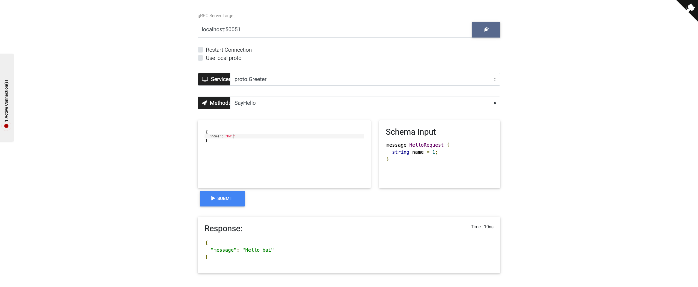

# grpcox教程
grpc版本的postman使用教程

## grpcox介绍

[grpcox](https://github.com/gusaul/grpcox)是一个非常棒的工具,类似postman一样,可以帮助人们调试grpc接口. 当然目前还不能做到像postman一样,实现很多自动化的功能,但是作为界面友好的调试助手已经足够了.


## 使用教程
所有文件都位于[我的github](https://github.com/nkbai/-grpcox-example)
### proto文件
#### proto文件
```proto
syntax = "proto3";


package proto;


// The greeting service definition.
service Greeter {
    // Sends a greeting
    rpc SayHello (HelloRequest) returns (HelloReply) {
    }
}

// The request message containing the user's name.
message HelloRequest {
    string name = 1;
}

// The response message containing the greetings
message HelloReply {
    string message = 1;
}
```
#### Makefile
```Makefile
.PHONY: gogen
gogen:
	protoc -I=.    -I=$(GOPATH)/src   --go_out=plugins=grpc:. ./*.proto

```


### grpcServer
按照grpcox文档中的说明,要求server必须支持reflection,对于go语言版本的grpc来说,支持的非常完善. 两行代码即可.

```go
package main

import (
	"log"
	"net"

	pb "github.com/nkbai/grpcox-example/proto"

	"golang.org/x/net/context"
	"google.golang.org/grpc"
	"google.golang.org/grpc/reflection" 
)

const (
	port = ":50051"
)

type Config struct {
	IP   string `json:"ip"`
	Port string `json:"port"`
}

// server is used to implement helloworld.GreeterServer.
type server struct{}

// SayHello implements helloworld.GreeterServer
func (s *server) SayHello(ctx context.Context, in *pb.HelloRequest) (*pb.HelloReply, error) {

	log.Println("get request")
	return &pb.HelloReply{Message: "Hello " + in.Name}, nil
}

func main() {
	lis, err := net.Listen("tcp", "0.0.0.0:50051")
	if err != nil {
		log.Fatalf("failed to listen: %v", err)
	}
	s := grpc.NewServer()
	pb.RegisterGreeterServer(s, &server{})
	// Register reflection service on gRPC server.
	reflection.Register(s)
	if err := s.Serve(lis); err != nil {
		log.Fatalf("failed to serve: %v", err)
	}
}
```

其中重要的是`	"google.golang.org/grpc/reflection" `和`reflection.Register(s)`两行.其他与普通的grpc server没有区别.


### grpcox和greeter_server配合效果

```bash
cd $GOPATH/github.com/nkbai/grpcox-example/greeter_server
go run main.go &
cd $GOPATH/github.com/gusaul/grpcox
go run grpcox.go 
```


然后打开浏览器:

